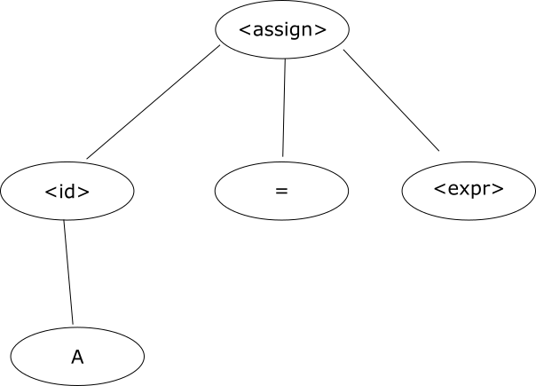

# Atividade 03

## Questão 01

### Item 0
A = B + C

```
<assign> => <id> = <expr>
=> A = <expr>
=> A = <expr> + <term>
=> A = <term> + <term>
=> A = <factor> + <term>
=> A = <id> + <term>
=> A = B + <term>
=> A = B + <factor>
=> A = B + <id>
=> A = B + C
```




## Questão 02

## Questão 03
